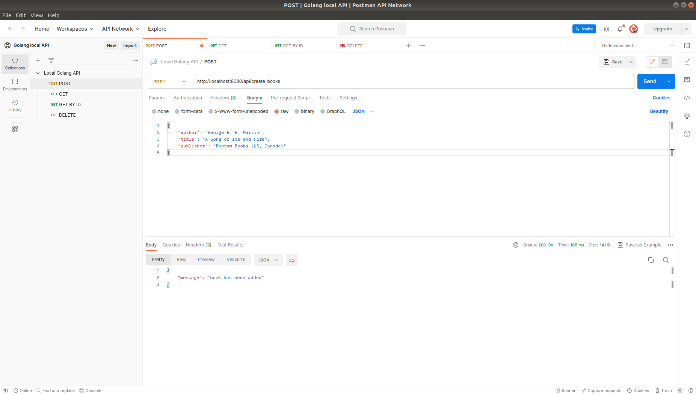
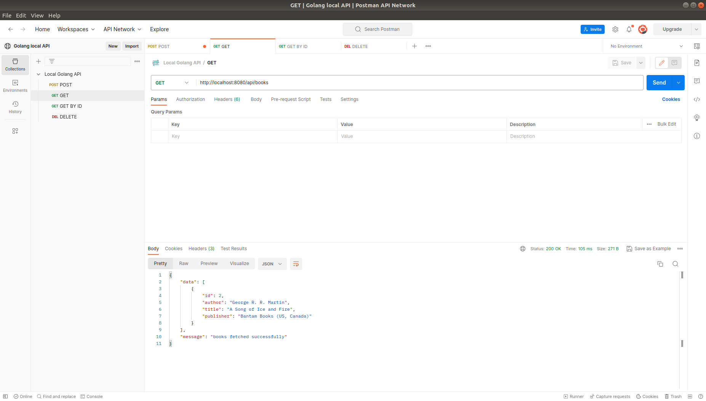
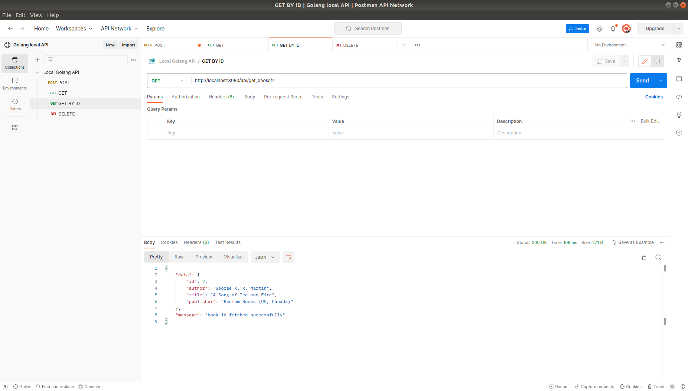
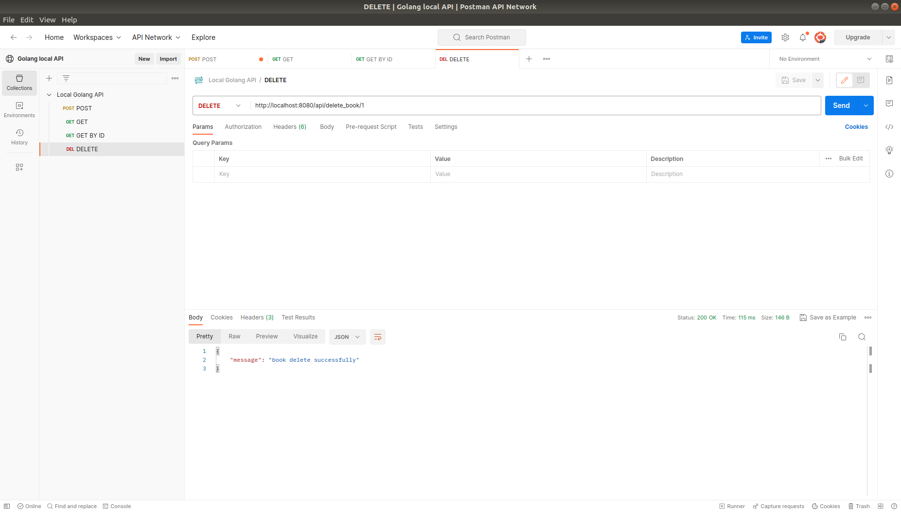

# go-api
golang rest API using fiber + postgresql

## installation

- `go get github.com/gofiber/fiber/v2`

- `go get github.com/joho/godotenv`
- `go get -u gorm.io/gorm`
- `go get -u gorm.io/driver/postgres`
- `go get -u gorm.io/driver/sqlite`

## RUN
- make sure 5432 port is free: `sudo lsof -i -P -n | grep LISTEN`
- start a postgres instance: `docker run --name postgres_db  -p 5432:5432 -e POSTGRES_USER=admin -e POSTGRES_PASSWORD=admin123123! -e POSTGRES_DB=postgres_db -d postgres` 
- run APP: `go run main.go`

## ENDPOINTS

- POST: http://localhost:8080/api/create_books

- GET: http://localhost:8080/api/books

- GET BY ID: http://localhost:8080/api/get_books/{id}

- DELETE: http://localhost:8080/api/delete_book/{id}

